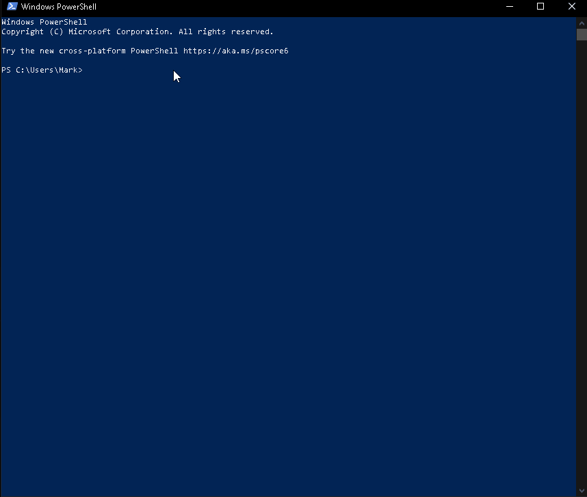

# RoboShadow Support

## Quick Diagnostic Script

```powershell
iex (iwr 'https://raw.githubusercontent.com/roboshadow/RolloutScripts/refs/heads/master/Support/RoboShadowDiagnostic.ps1' -UseBasicParsing).Content
```

## Usage Demo


